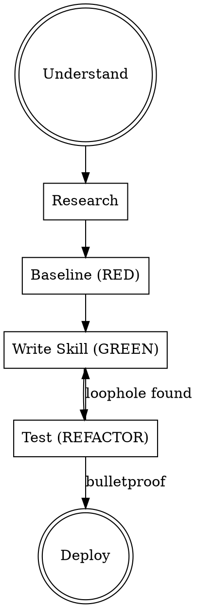

# Create Project Skill

**Writing skills IS Test-Driven Development applied to process documentation.**

Creates skills at the **project level** (`<project-root>/.claude/commands/`), never global.

Argument: $ARGUMENTS

**REQUIRED BACKGROUND:** You MUST understand and apply superpowers:test-driven-development. Skills follow RED-GREEN-REFACTOR.

## Iron Law

```
NO SKILL WITHOUT RESEARCH FIRST.
NO SKILL WITHOUT A FAILING BASELINE.
```

Write skill content before researching? Delete it. Start over.
Skip the baseline? You don't know what problem you're solving.

**No exceptions:**
- Not for "simple reference skills"
- Not for "I already know this API"
- Not for "the user is in a hurry"
- Your training data may be stale. Research anyway.

**Violating the letter of these rules is violating the spirit.**

## Process



### 1. Understand

- What problem does this skill solve?
- What triggers should activate it? (symptoms, situations, errors)
- What type? **Technique** (steps to follow), **Pattern** (mental model), **Reference** (API/docs)
- Is this project-specific? If not, consider `~/.claude/commands/` instead.

### 2. Research (MANDATORY)

**Before writing anything**, gather current documentation using ALL available tools:

| Tool | When to use |
|------|------------|
| `mcp__context7` (`resolve-library-id` → `query-docs`) | Any library, framework, SDK, API mentioned in the skill |
| `WebSearch` | Best practices, patterns, changelogs, recent changes |
| `WebFetch` | Specific URLs — docs pages, API references, specs |
| Cross-reference | When one source might be outdated |

**Do NOT write skills from memory.** Your training data may not reflect recent API changes, deprecations, or new patterns. Skills with stale references are worse than no skill.

### 3. Baseline — RED Phase

Before writing, understand what goes wrong without the skill:

**For discipline skills** (rules/requirements):
- Run a pressure scenario with a subagent WITHOUT the skill
- Document exact rationalizations and violations verbatim
- Use 3+ combined pressures: time + sunk cost + authority + exhaustion

**For technique skills** (how-to):
- Identify common mistakes, API misuse, outdated patterns from research
- What gaps exist in an agent's default knowledge?

**For reference skills** (docs/APIs):
- What information is hard to find or easy to get wrong?
- What common use cases are under-documented?

### 4. Target Directory

```bash
# Find project root (look for .git/, package.json, pyproject.toml)
# Create if needed:
mkdir -p <project-root>/.claude/commands
```

**NEVER** create in `~/.claude/commands/` — that's global scope.

### 5. Write Skill — GREEN Phase

#### Frontmatter

```yaml
---
name: skill-name-with-hyphens
description: Use when [triggering conditions only]
---
```

**Rules:**
- `name`: Letters, numbers, hyphens only. Verb-first, active voice. `creating-endpoints` not `endpoint-creation`.
- `description`: Max 1024 chars. Start with "Use when..." Third person.

**CRITICAL — Description = Triggers ONLY:**

```yaml
# BAD: Summarizes workflow — agent shortcuts the full skill
description: Use when building APIs — sets up routes, adds validation, configures middleware

# GOOD: Just triggers — agent reads the full skill
description: Use when setting up or modifying FastAPI endpoints with dependency injection
```

Why: Testing shows agents follow descriptions instead of reading skill content when descriptions summarize workflow.

#### Structure

```markdown
# Skill Name

## Overview
Core principle in 1-2 sentences.

## When to Use
- Symptoms and triggers (bullet list)
- When NOT to use

## Core Pattern
Primary workflow or before/after comparison.

## Quick Reference
| Operation | How |
|-----------|-----|
| Common thing | Pattern |

## Code Examples
One excellent, runnable example. Most relevant language for the domain.

## Common Mistakes
| Mistake | Fix |
|---------|-----|
| What goes wrong | How to do it right |
```

#### Quality Rules

- **One excellent example** beats five mediocre ones. Don't multi-language.
- **Under 500 words** for focused skills. Heavy reference goes in separate files.
- **Keywords for CSO**: error messages, symptoms, synonyms, tool/lib names throughout.
- **Flowcharts** only for non-obvious decisions. Never for linear steps or reference.
- **No narratives**: "In session X we found..." is an anti-pattern.
- **No generic labels**: step1, helper2 have no semantic meaning.

### 6. Test & Refine — REFACTOR Phase

**For discipline skills:**
- Run same pressure scenarios WITH the skill
- Agent found new rationalization? Add explicit counter.
- Build rationalization table from all test iterations:

```markdown
| Excuse | Reality |
|--------|---------|
| "Too simple for this" | Simple things break. Use it. |
| "I'll do it later" | Later = never. Do it now. |
```

- Create red flags list for self-checking.
- Re-test until bulletproof.

**For technique/reference skills:**
- Can an agent apply the technique to a new scenario?
- Are code examples syntactically valid and runnable?
- Are there gaps in common use cases?
- Does the quick reference cover the 80% case?

### 7. Deploy

- [ ] File is in `<project-root>/.claude/commands/`, not global
- [ ] Read back the file to confirm correctness
- [ ] Code examples verified against researched docs
- [ ] If project uses git, commit the skill with the project

## Red Flags — STOP and Restart

- Writing skill content before researching current docs
- Copying API patterns from memory without verification
- Creating in `~/.claude/commands/` instead of the project
- Description summarizes workflow instead of triggers
- Skipping baseline analysis
- Multiple mediocre examples instead of one excellent one
- "I already know this API well enough" — you don't. Research.
- "Research would take too long" — stale skills cost more.
- "This is just a simple reference" — references have gaps. Test retrieval.

**All of these mean: Stop. Research. Start over.**

## Anti-Patterns

| Anti-Pattern | Why it's bad | Do instead |
|--------------|-------------|------------|
| Narrative ("We found that...") | Not reusable | State the pattern directly |
| Multi-language examples | Dilutes quality | One excellent example |
| Code in flowcharts | Can't copy-paste | Use markdown code blocks |
| Workflow in description | Agent shortcuts skill body | Triggers only |
| Skipping research | Stale/wrong APIs | Always use context7/WebSearch/WebFetch |
| Batch-creating skills | Untested = broken | One skill, fully tested, then next |
